# AI Studio 0.7.0 Logical ERD

状态：DEV-049 实现基线；不创建新的 `scene_profile_bindings`

适用版本：产品 0.6.2，数据迁移 001–023，Manifest 1，Backup 12

本文件描述逻辑关系。可执行 SQL 由已提交 migration 提供；多态 profile/profile_id 与 structure scope_id 由 service/resolver 做边界校验，不伪造 SQLite 外键。

## 1. 事实来源与边界

- Migration 022 已落地 Profile、CostumeVariant、ReferenceSet、ReferenceSetItem、ProfileRevision，以及 Shot-level bindings。
- Migration 023 以 forward-only 方式补齐 Project/Series/Episode/Scene scoped bindings；022 不修改、不重算 checksum。
- Shot 继续复用 022 的 `shot_profile_bindings` 和 `shot_reference_set_bindings`，不再创建第二套 Shot 表。
- Asset 仍由现有 `assets` 表拥有；ReferenceSet 只引用 Asset 并保存稳定 ordinal/role/primary 信息。
- `ResolvedShotContext`、`ShotReferencePack`、Readiness 都是派生模型；本 DEV 不创建 context snapshot/readiness cache。

## 2. 解析关系

```mermaid
erDiagram
  projects ||--o{ character_profiles : owns
  projects ||--o{ scene_profiles : owns
  projects ||--o{ prop_profiles : owns
  projects ||--o{ style_profiles : owns
  character_profiles ||--o{ costume_variants : has
  projects ||--o{ reference_sets : owns
  reference_sets ||--o{ reference_set_items : contains
  assets ||--o{ reference_set_items : referenced
  profile_revisions }o..|| profiles : logical_profile

  projects ||--o{ consistency_scope_profile_bindings : scopes
  projects ||--o{ consistency_scope_reference_set_bindings : scopes
  production_series ||..o{ consistency_scope_profile_bindings : PROJECT_SERIES
  production_episodes ||..o{ consistency_scope_profile_bindings : PROJECT_EPISODE
  production_scenes ||..o{ consistency_scope_profile_bindings : PROJECT_SCENE
  production_series ||..o{ consistency_scope_reference_set_bindings : PROJECT_SERIES
  production_episodes ||..o{ consistency_scope_reference_set_bindings : PROJECT_EPISODE
  production_scenes ||..o{ consistency_scope_reference_set_bindings : PROJECT_SCENE

  shots ||--o{ shot_profile_bindings : binds
  shots ||--o{ shot_reference_set_bindings : binds
  reference_sets ||--o{ shot_reference_set_bindings : reused

  assets ||--o{ shot_reference_assets : legacy
  shots ||--o{ shot_reference_assets : legacy
  reference_anchors ||--o{ reference_anchor_assets : legacy
  assets ||--o{ reference_anchor_assets : legacy
```



`profiles` 只是 `profile_type + profile_id` 的逻辑多态集合，实际表仍为四类 profile 表。`scope_id` 同样依赖 `ConsistencyScopeType`：PROJECT 直接等于 project，SERIES/EPISODE/SCENE 由一次 `load_tree_data(project_id)` 验证归属。

## 3. Migration 022：既有 Profile 与 Shot 数据

022 的一致性基础表包括：

- `character_profiles`
- `scene_profiles`
- `prop_profiles`
- `style_profiles`
- `costume_variants`
- `reference_sets`
- `reference_set_items`
- `profile_revisions`
- `shot_profile_bindings`
- `shot_reference_set_bindings`

Shot profile binding 的 role 为 CHARACTER/SCENE/PROP/STYLE；Shot reference-set binding 还允许 SHOT_REFERENCE。Profile 删除、ReferenceSet 删除、CostumeVariant 关系由现有 service/repository 保护。

## 4. Migration 023：上层 scope binding

023 只创建以下两张表：

### 4.1 `consistency_scope_profile_bindings`

| 字段 | 语义 |
| --- | --- |
| id | `hpb_` consistency ID |
| project_id | `projects(id)`，CASCADE |
| scope_type / scope_id | PROJECT、SERIES、EPISODE、SCENE；scope_id 为多态结构 ID |
| role | CHARACTER、SCENE、PROP、STYLE |
| profile_type / profile_id | 逻辑 profile 关系，由 service 校验 |
| costume_variant_id | 可选，RESTRICT；只允许 Character binding |
| ordinal | 非负稳定排序 |
| inheritance_mode | EXPLICIT、INHERITED、REPLACE、REMOVE |
| created_at / updated_at | UTC 时间 |

### 4.2 `consistency_scope_reference_set_bindings`

| 字段 | 语义 |
| --- | --- |
| id | `hrb_` consistency ID |
| project_id | `projects(id)`，CASCADE |
| scope_type / scope_id | PROJECT、SERIES、EPISODE、SCENE；不包含 SHOT |
| role | CHARACTER、SCENE、PROP、STYLE、SHOT_REFERENCE |
| reference_set_id | `reference_sets(id)`，RESTRICT |
| ordinal / required | 非负顺序与 required 标记 |
| inheritance_mode | EXPLICIT、INHERITED、REPLACE、REMOVE |
| created_at / updated_at | UTC 时间 |

两张表均有 scope、entity 相关索引与 project-scoped 唯一关系约束。数据库不单独阻止同 scope 同 role+ordinal 的不同 entity；写入 service 与 resolver 都必须检查并返回冲突诊断。

## 5. 五级 binding 读取路径

```text
Project → Series → Episode → Scene → Shot
   023      023       023       023     022
```

`ConsistencyScopeRepository` 一次加载 project 下全部上层 binding；Shot 通过 022 的 bulk binding 读取。Resolver 从结构树确定一条 shot 路径，按父到子合并，保留 `SourceTrace`，再展开有效 ReferenceSet 为 concrete image assets。

Shot 未分配 Scene 时仍解析 `Project → Shot`；没有结构层级不能成为旧项目解析失败的理由。

## 6. 保留的旧生产关系

以下表及生产链不因 DEV-049 改变：

- `projects`、`assets`、`shots`
- `shot_stage_configs`、`shot_stage_prompts`
- `shot_reference_assets`、`shot_generation_links`
- `reference_anchors`、`reference_anchor_assets`
- `production_series`、`production_episodes`、`production_scenes`
- `shot_scene_assignments`
- `production_batches`、`production_batch_items`、`production_runs`、`production_stages`、`production_stage_items`
- `generation_snapshots`

没有新 binding 时，Resolver 仍使用 Shot 的 legacy prompt/reference/stage config。

## 7. 明确不建的表/关系

DEV-049 不创建 `scene_profile_bindings`、`shot_context_snapshots`、`shot_readiness_cache`、第二 queue、第二 executor 或 graph database。Readiness/Preflight 属于 DEV-050；Production Preparation/快照属于后续 DEV。

## 8. Forward-only 迁移约束

- 不修改已进入 master 的 022，避免已执行数据库的 SQLx checksum mismatch。
- fresh 001→023 与 022→023 均保留旧 consistency/production rows。
- 产品兼容版本继续为 0.6.2，Manifest 1、Backup 12 不变。
