# AI Studio 0.7.0 Logical ERD

状态：DEV-052 实现基线；不创建新的 `scene_profile_bindings`

适用版本：产品 0.6.2，数据迁移 001–024，Manifest 2，Backup 14

本文件描述逻辑关系。可执行 SQL 由已提交 migration 提供；多态 profile/profile_id 与 structure scope_id 由 service/resolver 做边界校验，不伪造 SQLite 外键。

## 1. 事实来源与边界

- Migration 022 已落地 Profile、CostumeVariant、ReferenceSet、ReferenceSetItem、ProfileRevision，以及 Shot-level bindings。
- Migration 023 以 forward-only 方式补齐 Project/Series/Episode/Scene scoped bindings；022 不修改、不重算 checksum。
- Shot 继续复用 022 的 `shot_profile_bindings` 和 `shot_reference_set_bindings`，不再创建第二套 Shot 表。
- Asset 仍由现有 `assets` 表拥有；ReferenceSet 只引用 Asset 并保存稳定 ordinal/role/primary 信息。
- `ResolvedShotContext`、`ShotReferencePack`、Readiness 都是派生模型；Preparation 只在用户明确准入时写入不可变的历史证据快照，不创建 readiness cache。
- `production_preparation_snapshots` 保存快照与 ProductionBatchItem 的实时关联；快照 JSON 内的 identity 是历史证据，恢复备份时可保留原值，外层 FK 列负责新的实时关联。

## 2. 解析关系

```mermaid
erDiagram
  projects ||--o{ character_profiles : owns
  projects ||--o{ scene_profiles : owns
  projects ||--o{ prop_profiles : owns
  projects ||--o{ style_profiles : owns
  character_profiles ||--o{ costume_variants : has
  projects ||--o{ reference_sets : owns
  reference_sets ||--o{ reference_set_items : contains
  assets ||--o{ reference_set_items : referenced
  profile_revisions }o..|| profiles : logical_profile

  projects ||--o{ consistency_scope_profile_bindings : scopes
  projects ||--o{ consistency_scope_reference_set_bindings : scopes
  production_series ||..o{ consistency_scope_profile_bindings : PROJECT_SERIES
  production_episodes ||..o{ consistency_scope_profile_bindings : PROJECT_EPISODE
  production_scenes ||..o{ consistency_scope_profile_bindings : PROJECT_SCENE
  production_series ||..o{ consistency_scope_reference_set_bindings : PROJECT_SERIES
  production_episodes ||..o{ consistency_scope_reference_set_bindings : PROJECT_EPISODE
  production_scenes ||..o{ consistency_scope_reference_set_bindings : PROJECT_SCENE

  shots ||--o{ shot_profile_bindings : binds
  shots ||--o{ shot_reference_set_bindings : binds
  reference_sets ||--o{ shot_reference_set_bindings : reused

  assets ||--o{ shot_reference_assets : legacy
  shots ||--o{ shot_reference_assets : legacy
  reference_anchors ||--o{ reference_anchor_assets : legacy
  assets ||--o{ reference_anchor_assets : legacy

  projects ||--o{ production_preparation_snapshots : owns
  shots ||--o{ production_preparation_snapshots : prepared
  production_batches ||--o{ production_preparation_snapshots : records
  production_batch_items ||--o| production_preparation_snapshots : freezes
```



`profiles` 只是 `profile_type + profile_id` 的逻辑多态集合，实际表仍为四类 profile 表。`scope_id` 同样依赖 `ConsistencyScopeType`：PROJECT 直接等于 project，SERIES/EPISODE/SCENE 由一次 `load_tree_data(project_id)` 验证归属。

## 3. Migration 022：既有 Profile 与 Shot 数据

022 的一致性基础表包括：

- `character_profiles`
- `scene_profiles`
- `prop_profiles`
- `style_profiles`
- `costume_variants`
- `reference_sets`
- `reference_set_items`
- `profile_revisions`
- `shot_profile_bindings`
- `shot_reference_set_bindings`

Shot profile binding 的 role 为 CHARACTER/SCENE/PROP/STYLE；Shot reference-set binding 还允许 SHOT_REFERENCE。Profile 删除、ReferenceSet 删除、CostumeVariant 关系由现有 service/repository 保护。

## 4. Migration 023：上层 scope binding

023 只创建以下两张表：

### 4.1 `consistency_scope_profile_bindings`

| 字段 | 语义 |
| --- | --- |
| id | `hpb_` consistency ID |
| project_id | `projects(id)`，CASCADE |
| scope_type / scope_id | PROJECT、SERIES、EPISODE、SCENE；scope_id 为多态结构 ID |
| role | CHARACTER、SCENE、PROP、STYLE |
| profile_type / profile_id | 逻辑 profile 关系，由 service 校验 |
| costume_variant_id | 可选，RESTRICT；只允许 Character binding |
| ordinal | 非负稳定排序 |
| inheritance_mode | EXPLICIT、INHERITED、REPLACE、REMOVE |
| created_at / updated_at | UTC 时间 |

### 4.2 `consistency_scope_reference_set_bindings`

| 字段 | 语义 |
| --- | --- |
| id | `hrb_` consistency ID |
| project_id | `projects(id)`，CASCADE |
| scope_type / scope_id | PROJECT、SERIES、EPISODE、SCENE；不包含 SHOT |
| role | CHARACTER、SCENE、PROP、STYLE、SHOT_REFERENCE |
| reference_set_id | `reference_sets(id)`，RESTRICT |
| ordinal / required | 非负顺序与 required 标记 |
| inheritance_mode | EXPLICIT、INHERITED、REPLACE、REMOVE |
| created_at / updated_at | UTC 时间 |

两张表均有 scope、entity 相关索引与 project-scoped 唯一关系约束。数据库不单独阻止同 scope 同 role+ordinal 的不同 entity；写入 service 与 resolver 都必须检查并返回冲突诊断。

## 5. 五级 binding 读取路径

```text
Project → Series → Episode → Scene → Shot
   023      023       023       023     022
```

`ConsistencyScopeRepository` 一次加载 project 下全部上层 binding；Shot 通过 022 的 bulk binding 读取。Resolver 从结构树确定一条 shot 路径，按父到子合并，保留 `SourceTrace`，再展开有效 ReferenceSet 为 concrete image assets。

Shot 未分配 Scene 时仍解析 `Project → Shot`；没有结构层级不能成为旧项目解析失败的理由。

## 6. Migration 024：Production Preparation Snapshot

`production_preparation_snapshots` 是准入时写入的冻结证据，不是运行时 readiness cache。每条记录绑定一个
`project_id + shot_id + stage + context_hash` 和一个唯一的 `production_batch_item_id`，并记录
`production_batch_id`。表具有 project/shot/batch/item 外键及以下查询索引：

- `(project_id, shot_id, stage, context_hash)`：相同上下文的幂等判断与历史查询。
- `(production_batch_id)`：批次审计。
- `(production_batch_item_id)`：按队列 item 读取快照。

Batch 或 BatchItem 删除可以级联删除快照；Profile、ReferenceSet、Asset 不被快照反向级联。快照 JSON 的
`schemaVersion` 当前为 `1`，保存 resolved context、readiness、prompt、ordered references、workflow/recipe、
output、stage input、冻结 generation values 与最小 Comfy capability evidence。它是 immutable evidence，不作为
实时关联使用；实时关联只使用表外层已经 remap 的 ID。

## 7. 保留的旧生产关系

以下表及生产链不因 DEV-049 改变：

- `projects`、`assets`、`shots`
- `shot_stage_configs`、`shot_stage_prompts`
- `shot_reference_assets`、`shot_generation_links`
- `reference_anchors`、`reference_anchor_assets`
- `production_series`、`production_episodes`、`production_scenes`
- `shot_scene_assignments`
- `production_batches`、`production_batch_items`、`production_runs`、`production_stages`、`production_stage_items`
- `generation_snapshots`

没有新 binding 时，Resolver 仍使用 Shot 的 legacy prompt/reference/stage config。

## 8. 明确不建的表/关系

不创建 `scene_profile_bindings`、`shot_context_snapshots`、`shot_readiness_cache`、第二 queue、第二 executor 或 graph database。
Readiness 继续动态计算；Production Preparation 与 Admission 复用现有 ProductionBatch、ProductionQueueService、
GenerationService、WorkflowCompiler 和 ComfyUI 边界。

## 9. Forward-only 迁移约束

- 不修改已进入 master 的 022，避免已执行数据库的 SQLx checksum mismatch。
- fresh 001→024 与 023→024 均保留旧 consistency/production rows。
- 产品兼容版本继续为 0.6.2；Manifest 保持 2，Backup 为 14；不得创建 Manifest 3 或修改 001–023。

## 10. DEV-054 集成增量

DEV-054 没有增加新的持久化事实表。已落地的应用层关系如下：

    scope binding command
      → ConsistencyScopeBindingService / ShotConsistencyBindingService
      → ConsistencyScopeRepository / ShotConsistencyRepository
      → SQLite combined replace transaction

    shot_context_draft_get
      → shared ShotContextResolver
      → ResolvedShotContext
      → Readiness / Preparation snapshot（仅用户明确准入时）
      → existing ProductionBatch / ProductionQueue

- Project、Series、Episode、Scene 的 binding 由一次 load_tree_data(project_id) 校验 scope path；Shot binding 复用 022 的两张 Shot binding 表。
- UI wire DTO 不暴露完整 Rust domain struct，不提交 timestamp；backend 生成 binding ID/time，更新保留 created_at。
- ResolvedShotContext 的 source trace、ordered ReferenceSet assets、prompt segments、selected video image id/sha256 和 context hash 都是派生结果；它们不在数据库中复制成第二份 live context。
- Preparation snapshot 的 JSON 是 immutable evidence，包含 context、readiness、prompt、references、workflow/recipe、output、stage input 和最小 Comfy capability evidence；历史审计优先读取该 JSON。
- 无有效新 ReferenceSet 时，resolver 仍从旧 Shot prompt/reference/stage config 构建 legacy context；legacy compatibility 不需要 backfill。
- DEV-054 不创建 scene_profile_bindings、shot_context_snapshots、shot_readiness_cache、migration 025、第二 queue、第二 executor 或 graph database。
